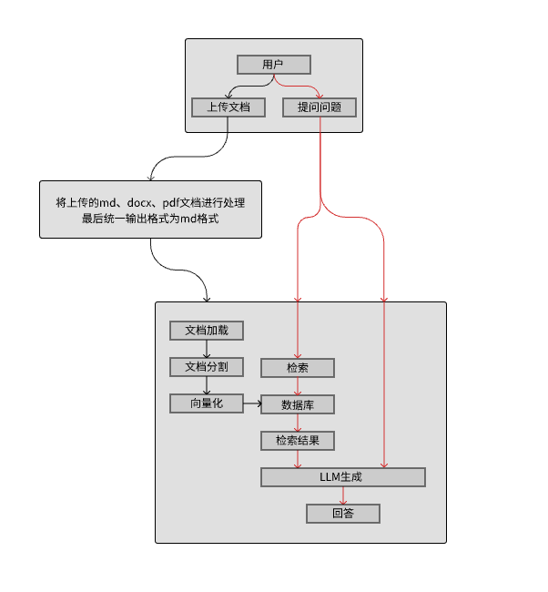

## 一 用户模块√

### 1.1 上传文档√

用户可以上传支持的文件类型（如 .md、.docx、.pdf）到系统。

- **输入**：kb_code, file_path。
- **输出**：保证在指定路径。database/kbs/kb_code/xxx.docx(.md, .pdf)

### 1.2 提问√

用户可以基于上传的文档提出问题，系统将从知识库中生成答案。

- **输入**：kb_code，question。
- **输出**：answer。

## 二 数据预处理模块√

### 2.1 处理docx文件√

对docx文件进行处理。需要人工校验。

- **输入**：kb_code，database/kbs/kb_code/xxx.docx。
  - 按照一二三级标题，保存为对应有一二三级标题的md格式，database/kbs_md/kb_code/xxx.md。
  - 将md中的图片进行保存在本地database/kbs_imgs/kb_code/路径下；
  - 将md中的图片进行保存在服务器上，并生成图片的url地址来替换原有图片的位置。
  - 对md文件按照标题进行分块，结果保存在database/kbs_chunks/kb_code/下。
- **输出**：
  - 原文件地址：database/kbs/kb_code/xxx.docx
  - md文件地址：database/kbs_md/kb_code/xxx.md
  - imgs路径地址：database/kbs_imgs/kb_code/
  - chunks路径地址：database/kbs_chunks/kb_code/

### 2.2 处理pdf文件√

使用MinerU将pdf处理为md格式。配置环境需注意要求的版本。注意处理后的格式，最好需要人工校验。

- **输入**：kb_code，database/kbs/kb_code/xxx.pdf。
  - 通过MinerU将pdf处理为md格式保存在database/kbs_md/kb_code/xxx.md；
  - 按照上述处理md进行处理。
- **输出**：
  - 原文件地址：database/kbs/kb_code/xxx.pdf
  - md文件地址：database/kbs_md/kb_code/xxx.md
  - imgs路径地址：database/kbs_imgs/kb_code/
  - chunks路径地址：database/kbs_chunks/kb_code/

### 2.3 处理MP4文件

通过脚本，将视频进行分割存储，保留时间帧信息，检索返回时间帧，来截取原视频中最相关的片段。

- **输入**：kb_code，database/kbs/kb_code/xxx.mp4。

  - 通过脚本将视频按照固定间隔帧，分割为小片段图片，图片命名为时间帧，存储在imgs路径地址下。

  - 对每个图片进行多模态处理，描述图片内容，存储在chunks路径地址下，命名为对应的时间帧，内容为图片描述的str，格式为txt格式。metadata中要包含file与frame信息。
  - 所有汇总信息存储在md文件地址下。

- **输出**：

  - 原文件地址：database/kbs/kb_code/xxx.mp4
  - md文件地址：database/kbs_md/kb_code/xxx.md
  - imgs路径地址：database/kbs_imgs/kb_code/
  - chunks路径地址：database/kbs_chunks/kb_code/

## 三 RAG系统模块√

通过LanChain大语言模型框架进行开发。

### 3.1 创建知识库√

创建空知识库，将知识库信息存储在sql数据库中，避免系统意外中断，导致缓存消失。

- **输入**：brand(汽车品牌), model(型号), kb_code(知识库编码), kb_name(知识库名称), description(知识库描述)。
  - 知识库表：列名[id, brand, model, kb_code, kb_name, description, delete_dirs，state，create_time]。
  - 知识库文档表：列名[id, kb_code, file_name, file_type, page_qty, file_size, delete_dirs, upload_time]。
  - Milvus向量数据库：库名kb_code。

- **输出**：sql中新建两个表knowledge_base(知识库表)、kb_files(知识库文档表)(目前为空)，新建Milvus向量数据库。

### 3.2 管理知识库√

- **展示知识库所有相关数据**：展示指定知识库以及相关联的所有文档。
  - **输入**：无。
  - **输出**：列表包含知识库的字典，[{}, {}, ......]。

- **知识库追加文档**：用户上传文档，经过预处理后，添加到Milvus向量数据库中，并在数据库中更新数据。
  - **输入**：kb_code, file_path。
    - 上传文档：用户上传文档到指定路径。

    - 数据预处理：对指定路径下的文件进行处理后，将生成的md文件存储在指定知识库路径下，**database/kbs_chunks/kb_code/**。

    - 分割向量化并存入数据库：**kbs_chunks/kb_code/**文档加载、分割、向量化后存入Milvus向量数据库中。

    - 更新知识库文档表：将对应信息添加添加到表中。

  - **输出**：本地知识库添加路径，sql数据库更新，Milvus向量数据库更新。

- **知识库删除指定文档**：用户选择删除知识库中的指定文档后，同步删除sql数据库、Milvus向量数据库以及本地数据库中的对应文档内容。
  - **输入**：kb_code，file_name。
    - 更新知识库文档表：更新删除文档后的表。

  - **输出**：本地知识库删除路径，sql数据库删除文档信息，Milvus向量数据库删除对应向量。

- **删除知识库**：用户删除指定知识库，删除sql数据库、Milvus向量数据库以及本地数据库对应知识库全部内容。
  - **输入**：kb_code。
    - 更新知识库表：删除kb_name对应的所有数据。
    - 更新知识库文档表：删除kb_name对应的所有数据。

  - **输出**：本地知识库删除知识库全部路径，sql数据库删除知识库全部相关联信息，Milvus向量数据库删除对应知识库。

### 3.3 知识库问答√

- **初始化问答链**：
  - **输入**：kb_code。
  - **输出**：self.chains更新。
- **回答**：
  - **输入**：kb_code，question。
  - **输出**：answer。